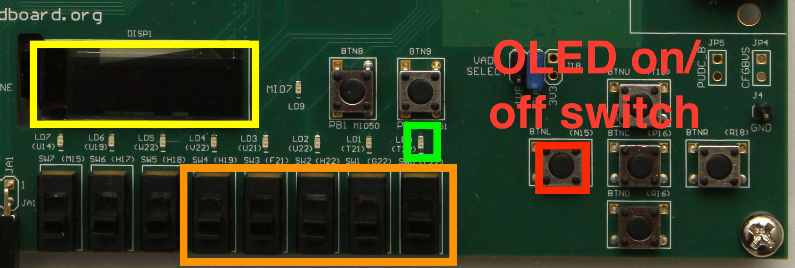

The LC4 ALU module performs all of the arithmetic and logical
operations for the various instructions. In this lab you'll build a
self-contained ALU datapath with the corresponding control signals.

## ALU Specification

Your code should live in the `lc4_alu` module. This module takes a
16-bit instruction and two 16-bit data values (`rs` is in `r1data` and `rt` is in `r2data`), corresponding to the
two register values, as input, and generates a single 16-bit output:

+ Basic ALU operations (ADD, MUL, SUB, DIV, MOD, AND, NOT, OR, XOR,
SLL, SRA, SRL, CONST, HICONST): output the value that should be
written back to the register file. 
+ You can use **only a single instance** of your `cla16` module, for all operations that need addition or subtraction. You can place a mux in front of the `cla16` inputs to reuse this single instance for all the different addition/substraction operations that are needed. 
+ Use your `lc4_divider` module for DIV and MOD. 
+ **Do not use Verilog's `+` `-` `/` `%` operators.** You can however use Verilog's `*` for your `MUL` implementation, and the various shift `<<` `>>` `>>>` and comparison operators `==` `!==` `<` `<=` `>` `>=`
+ Memory operations (LDR, STR): output the generated effective memory address.
+ Comparison instructions (CMP, CMPU, CMPI, CMPIU): Output zero (`0000 0000 0000 0000`), one (`0000 0000 0000 0001`), or negative one (`1111 1111 1111 1111`), depending on the result of the comparison. This will be used later to set the NZP bits.
+ Branch instructions (BR, JMP, JMPR, JSR, JSRR, RTI, TRAP), the PC of the next instruction *if the branch were to be taken*. The ALU should not decide whether or not the branch actually will be taken, that will be done elsewhere in the datapath.
+ No-op (NOP) should be treated as if it is a `BR` instruction. When you implement your full datapath, a NOP will be treated as a non-taken `BR`.
+ For `HICONST`, `r1data` holds the `rs` value.
+ All other operations: output zero (`0000 0000 0000 0000`).

## ALU implementation pointers

+ **Do not start implementing until your schematic is complete!**
+ Implement the basic ALU operations, leveraging your `cla16` module.
+ Implement DIV and MOD using your `lc4_divider` module.
+ For shift operations, you can use the shift operators `<<` `>>` `>>>`.
+ For comparisons, we recommend using Verilog's comparison operators `>`,`<`,`<=`,`>=` in combination 
  with the ternary operator. All wires in Verilog are unsigned by default, but the `signed` type is 
  useful for implementing the `cmp` and `cmpi` instructions.

## Testing

The testbench of the ALU is in `testbench_lc4_alu.v`, which internally
uses `lc4_prettyprint_errors.v`.

The testbench reads a series of instructions, PC, register values, and
expected results from the input trace, executes them on your ALU,
compares your result to the expected result, and prints a detailed
error message if the two differ. The error message prints instructions
in assembly format for easier cross-referencing with the [LC4 ISA documentation](http://cis.upenn.edu/~cis371/current/lc4.html).

## (Not for Spring 2021) ZedBoard demo

This demo allows you to run a series of test inputs through your
ALU. The inputs, and your ALU's output, are shown on the ZedBoard's
OLED display (yellow box in the picture below). You can use the 5
low-order switches (orange box) to switch among the 32 test
inputs.

**To preserve the life of the OLED display** you **must** power it off
  before you shut off power to the ZedBoard. Do this via the
  direction-pad button closest to the switches (`BTNL` aka `N15`, the
  red box in the picture below). The rightmost LED (green box) lights
  up whenever the OLED display is on. When you press the OLED on/off
  button, the display (and the LED) go off, letting you know that
  you've powered down the display appropriately.

